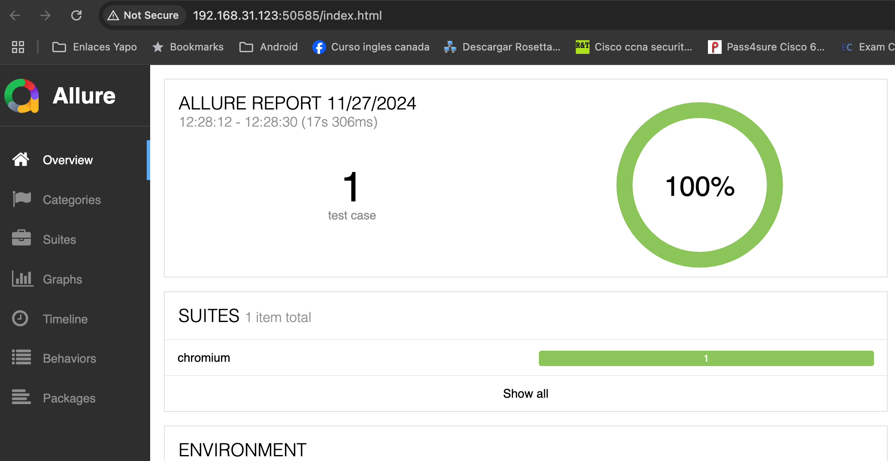
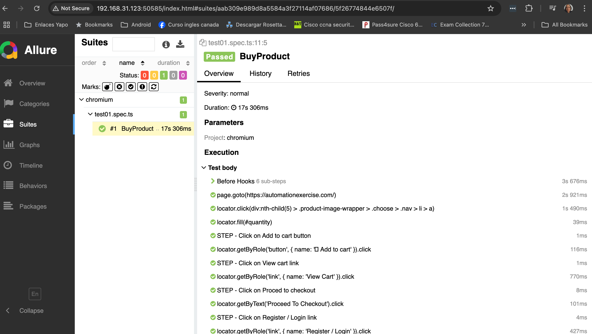

# About the project: 

**This automation project outlines the user flow for navigating the website, selecting a product, adding it to the cart, and proceeding to checkout in https://automationexercise.com/**

## About the Framework
***Playwright with TypeScript*** is an excellent choice due to its ease of use with a straightforward API and built-in features like auto-waiting and advanced debugging tools. It offers comprehensive testing capabilities, including multi-browser support and parallel execution. TypeScript enhances maintainability with static typing, while Playwright’s active community ensures robust support and frequent updates. Additionally, the use of the ***Page Object Model (POM)*** simplifies test code structure by encapsulating UI interactions in reusable and maintainable components, reducing redundancy and improving readability. Furthermore, integrating ***Allure Report*** provides detailed and visually appealing test reports, making it easier to analyze test results and debug issues. This combination delivers efficient, reliable, and scalable test automation while ensuring better organization and reporting.

## About testing
* Test case design
* Accessibility testing
* Performance testing
Please check the following link to know more about it: [Test documentation](TestDocument.md)

## Requirements 

* [Node.js](https://nodejs.org/en/)
* [NPM](https://www.npmjs.com/)
* [VSCode](https://code.visualstudio.com/)

## Setup

## Install Browser and Dependencies

Install project dependencies

```bash
npm init -y
```

Install playwright dependencies

```bash
npm init playwright@latest
```

## How to Run 

Run all Tests

```bash
npm run run-test
```

Generate Allure report

```bash
npm run generate-report
```

Open Allure report

```bash
npm run open-report
```
### Allure report



