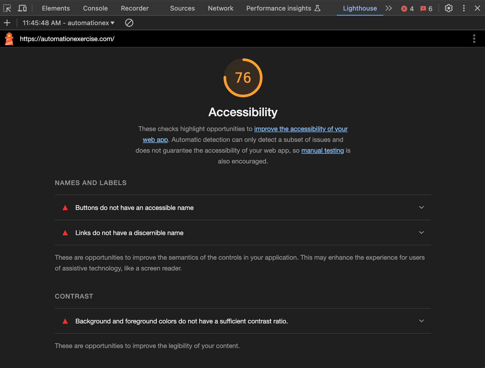
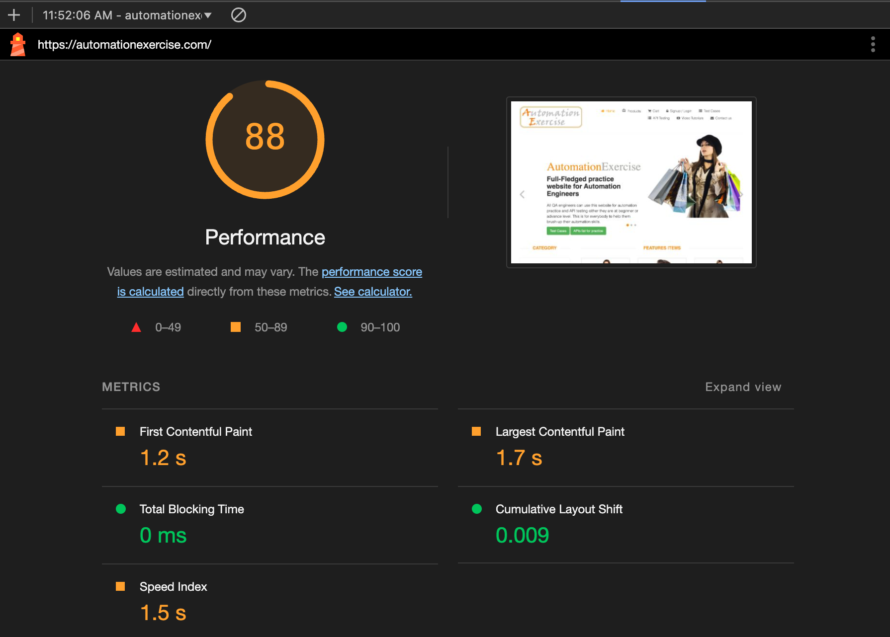

# Test Case Document: 

User Flow for Product Selection and Checkout

### Test Case Title

Product Selection, Cart Addition, and Checkout Flow

### Preconditions

1.	The website is accessible and functional.
2.	The user has a stable internet connection.
3.	A function or library to generate a random quantity between 1 and 20 is available.

### Test Steps

1.	Open a web browser and navigate to the website.
2.	Click on the “Products” section from the main menu.
3.	Locate the product list and select the third product displayed.
4.	View the product details.
5.	Enter a random quantity (1-20) into the quantity input field.
6.	Click the “Add to Cart” button.
7.	Navigate to the cart and proceed to the checkout page.
8.	Interact with the “Register/Login” modal:
9.	Confirm the order in the cart.
10.	Log out from the user account.

### Expected Results

1.	The website loads correctly.
2.	The “Products” section is accessible and displays a list of products.
3.	The details of the third product are displayed when selected.
4.	The random quantity is successfully input into the quantity field.
5.	The product is added to the cart, with the correct quantity reflected.
6.	The checkout page is displayed after proceeding from the cart.
7.	The “Register/Login” modal appears and functions as expected:
8.	The order is confirmed successfully in the cart.
9.	The user is logged out of the account without issues.

## Accessibility testing

Home screem https://automationexercise.com/

### Key Findings and Recommendations:

1. Buttons Without Accessible Names:
	- Issue: Certain buttons do not have discernible text or labels, making it difficult for assistive technologies to identify their purpose.
	- Recommendation: Provide accessible names for all button elements, either through visible text or by using aria-label attributes.
2. Links Without Discernible Names:
	- Issue: Some links are missing descriptive text, which can confuse users relying on screen readers.
	- Recommendation: Ensure all links have clear and descriptive text that indicates their destination or function.
3. Insufficient Color Contrast:
	- Issue: The contrast between text and background colors in certain areas is inadequate, making it hard for users with visual impairments to read content.
	- Recommendation: Adjust color schemes to meet the recommended contrast ratio guidelines, enhancing readability for all users.

## Performance testing

Home screen https://automationexercise.com/

### Key Findings and Recommendations:

1. Reduce Unused JavaScript:
	- Issue: The page is loading JavaScript files that are not utilized, leading to unnecessary data transfer and processing.
	- Recommendation: Identify and remove unused JavaScript to decrease load times and improve performance.

2. Optimize Image Formats:
	- Issue: Images are not in the most efficient formats, resulting in larger file sizes and slower load times.
	- Recommendation: Convert images to modern formats like WebP or AVIF to reduce file sizes without compromising quality.

